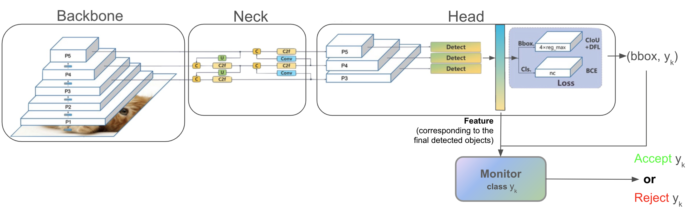

# Box-Based Monitor Approach for Out-of-Distribution Detection in YOLO: An Exploratory Study

This repository contains the code for the paper "Box-Based Monitor Approach for Out-of-Distribution Detection in YOLO: An Exploratory Study". The project investigates a novel method to detect out-of-distribution (OoD) samples in YOLO (You Only Look Once) object detection models using a box-based monitor approach. This approach leverages a geometric box structure to enclose regions in the logit space where the neural network makes decisions on in-distribution (ID) data, serving as a reference to monitor the network's behavior during deployment. Our preliminary results show that this box-based monitor significantly reduces false positive rates for OoD samples while maintaining a high true positive rate for ID samples, outperforming several existing logits-based scoring methods.


## Project Structure

The project is organized as follows:

- `yolov8FX/`: Contains the implementation of feature extraction for YOLOv8
- `yolov10FX/`: Contains the implementation of feature extraction for YOLOv10
- `evaluation.ipynb`: Jupyter notebook for experiment and evaluation
- `requirements.txt`: List of Python dependencies

## Requirements

To run this project, you need to have Python 3.9+ installed. The required dependencies are listed in the `requirements.txt` file. You can install them using:

```bash
pip install -r requirements.txt
```

## Usage

1. Clone the repository:
   ```
   git clone https://github.com/your-username/your-repo-name.git
   cd your-repo-name
   ```

2. Install the required dependencies:
   ```
   pip install -r requirements.txt
   ```

3. Run the evaluation notebook:
   ```
   jupyter notebook evaluation.ipynb
   ```

## Citation

If you use this code in your research, please cite our paper:

```
@inproceedings{he2024box,
  title={Box-Based Monitor Approach for Out-of-Distribution Detection in YOLO: An Exploratory Study},
  author={He, Wenyu and Wu, Chongrui and Bensalem, Sofiene},
  booktitle={International Conference on Runtime Verification},
  pages={229--239},
  year={2024},
  organization={Springer}
}
```

## License

This project is licensed under the MIT License - see the LICENSE file for details.